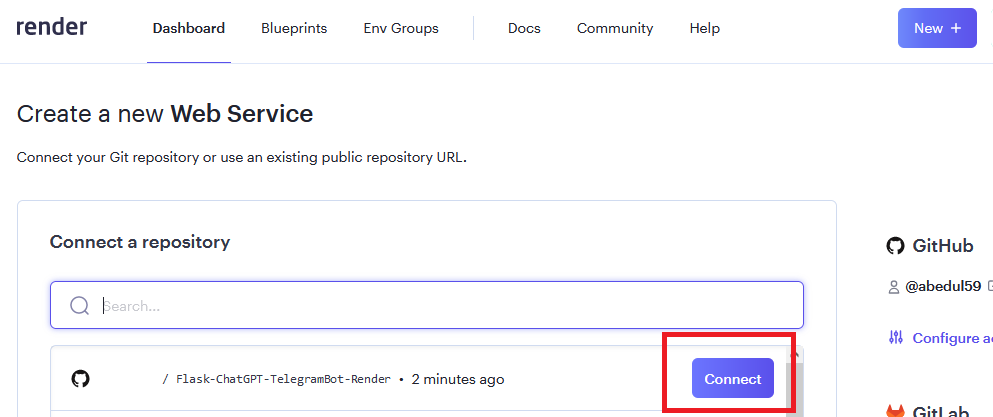
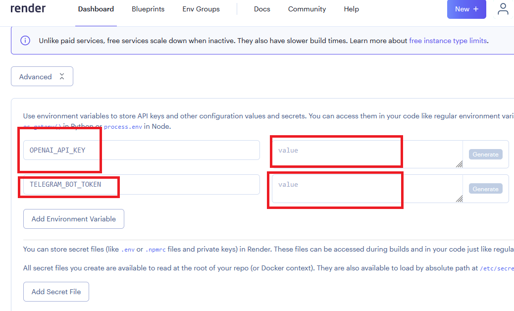

# Flask-ChatGPT-TelegramBot-Render
# 一個Flask ChatGPT TelegramBot快速建置於平台Render。

## [Vercel版本部屬](https://github.com/pyfbsdk59/Flask-ChatGPT-TelegramBot-Vercel)

### [English](https://github.com/pyfbsdk59/Flask-ChatGPT-TelegramBot-Render/blob/main/README_en.md)
### [日本語](https://github.com/pyfbsdk59/Flask-ChatGPT-TelegramBot-Render/blob/main/README_jp.md)

#### 1. 本專案參考了以下前輩和官方的方案改成製作，只針對剛學習Flask的朋友來佈置TelegramBot在Render上：

https://github.com/howarder3/GPT-Linebot-python-flask-on-vercel  
https://github.com/zaoldyeck/telegram-innovation-chatbot/tree/basic  
https://render.com/docs/deploy-flask  
https://israynotarray.com/nodejs/20221210/1224824056/

#### 2. 本專案因部屬在Render上，所以程式碼和Docker版本不同，也必須使用Flask和設定webhook。設定webhook請參考以下網址。Render網站中，選擇新增「Web Services」，可用github帳號匯入此專案，可先fork到自己的帳號，然後設定自己的名稱和選擇免費free方案。記得按下方「Advanced」，設定環境變數。

https://zaoldyeck.medium.com/%E6%89%8B%E6%8A%8A%E6%89%8B%E6%95%99%E4%BD%A0%E6%80%8E%E9%BA%BC%E6%89%93%E9%80%A0-telegram-bot-a7b539c3402a

  

  

#### 3. 必須在Render的Environment Variables設定兩個環境變數，分別是OPENAI_API_KEY和TELEGRAM_BOT_TOKEN。然後開始部屬，可能要花上一些時間。成功後複製自己的URL。例如：

https://xxx.onrender.com/

  

#### 4. 打開瀏覽器，輸入以下網址，設定webhook為部屬完Render的最後步驟，格式為：https://api.telegram.org/bot{$token}/setWebhook?url={$webhook_url}。

##### 故實際範例就像以下範例（非直接複製使用，請改用自己的telegram token和Render專案的URL）：

https://api.telegram.org/bot606248605:AAGv_TOJdNNMc_v3toHK_X6M-dev_1tG-JA/setWebhook?url=https://xxx.onrender.com/callback

#### 5. 成功後會顯示以下文字：

{
  ok: true,
  result: true,
  description: "Webhook was set"
}
------
### 創建Telegram機器人和取得token，請參考： 
https://ithelp.ithome.com.tw/articles/10245264  
https://tcsky.cc/tips-01-telegram-chatbot/
